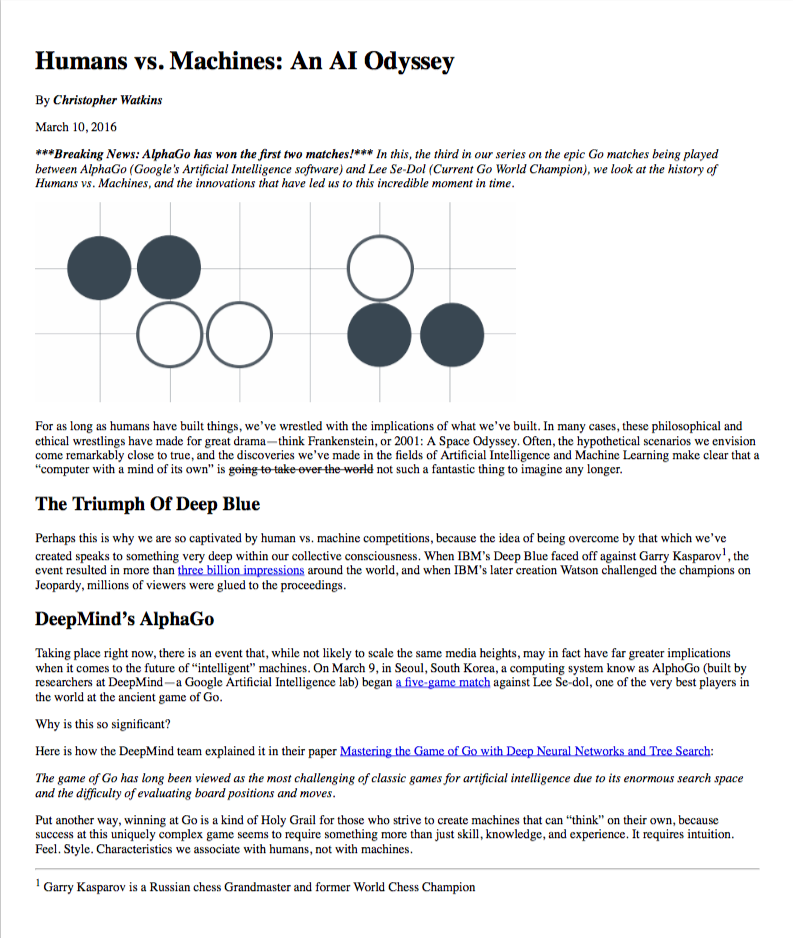

# Mockup to Article Project

## About:
* Purpose is to demonstrate knowledge of CSS and HTML properties.
* Images use correct source and all URL links are functional.
* All text is formatted correctly to mockup.
* Desired seperation is done without ` ` tags and instead accomplished with `
` tags.
